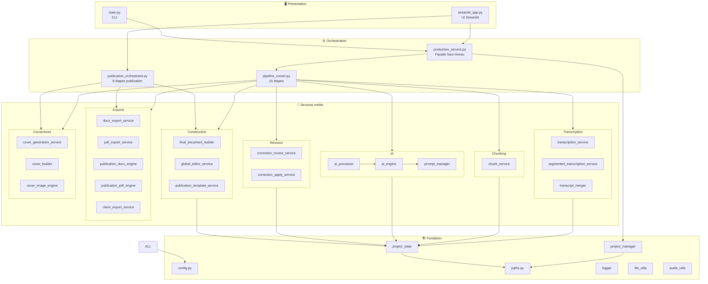
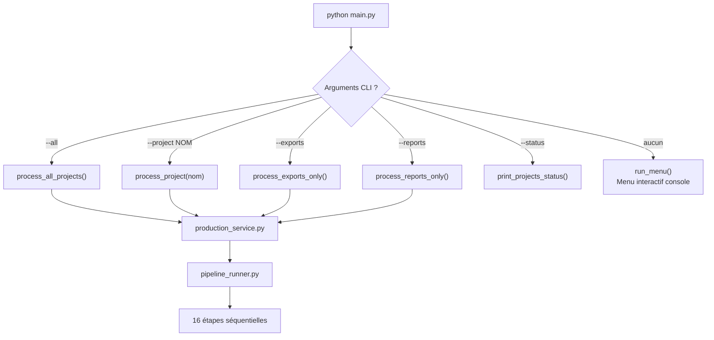
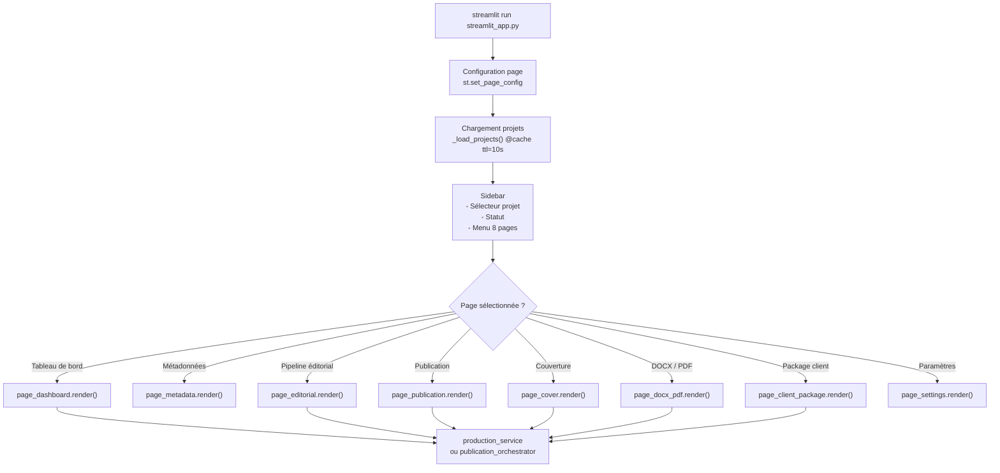

# Architecture Technique — PublishForge

## 1. Vue en couches

```
┌──────────────────────────────────────────────────────────────────┐
│                       COUCHE PRÉSENTATION                        │
│                                                                  │
│   streamlit_app.py (UI Streamlit)    main.py (CLI argparse)      │
│   app/ui/page_*.py (8 pages)         menu interactif             │
└───────────────────────────┬──────────────────────────────────────┘
                            │
┌───────────────────────────▼──────────────────────────────────────┐
│                      COUCHE ORCHESTRATION                        │
│                                                                  │
│   production_service.py        pipeline_runner.py                │
│   (façade haut niveau)         (16 étapes séquentielles)         │
│                                                                  │
│   publication_orchestrator.py  (8 étapes éditorial → livraison)  │
└───────────────────────────┬──────────────────────────────────────┘
                            │
┌───────────────────────────▼──────────────────────────────────────┐
│                    COUCHE SERVICES MÉTIER                        │
│                                                                  │
│  Transcription          Chunking          IA                     │
│  transcription_service  chunk_service     ai_processor           │
│  segmented_transcript   (8000 chars)      ai_engine              │
│  transcript_merger      PARTIE-aware      prompt_manager         │
│                                                                  │
│  Révision               Construction      Publication            │
│  correction_review      final_document    publication_template   │
│  correction_apply       global_editor     publication_builder    │
│                         (harmonisation)   publication_sanitizer  │
│                                                                  │
│  Exports                Couvertures       Rapports               │
│  docx_export            cover_generation  report_service         │
│  pdf_export             cover_builder     publication_quality    │
│  pub_docx_engine        cover_image_engine                       │
│  pub_pdf_engine         cover_layout                             │
│  client_export (ZIP)                                             │
└───────────────────────────┬──────────────────────────────────────┘
                            │
┌───────────────────────────▼──────────────────────────────────────┐
│                      COUCHE FONDATION                            │
│                                                                  │
│  project_manager.py    project_state.py    paths.py              │
│  (AudioProject)        (JSON state machine) (chemins système)    │
│                                                                  │
│  config.py             logger.py           file_utils.py         │
│  (configuration)       (événements JSON)   (hash, sanitize)      │
│                                                                  │
│  audio_utils.py        sleep_guard.py      prompt_utils.py       │
│  (ffmpeg, durée)       (veille Windows)    (rendu {{TEXT}})       │
└──────────────────────────────────────────────────────────────────┘
```

---

## 2. Diagramme d'architecture (Mermaid)



---

## 3. Points d'entrée — Détail

### `main.py` — CLI principal

**Rôle :** Orchestrateur en ligne de commande.  
**Séquence d'exécution :**



**Modules appelés :** `production_service`, `project_manager`

---

### `streamlit_app.py` — UI Web

**Rôle :** Interface graphique locale Streamlit, 8 pages de navigation.  
**Séquence d'exécution :**



**Modules appelés :** `ui_status_service`, `project_state`, `paths`, toutes les pages `app/ui/`

---

## 4. Principes architecturaux

### A — Idempotence totale

Chaque étape vérifie si son résultat est déjà produit et à jour avant d'exécuter.  
**Mécanisme :**
- Chunks : comparaison hash SHA256 du contenu
- Documents finals : signature dictionnaire `{source/chunk.md: md5_hash}`
- Audio : hash MD5 du fichier source

### B — Reprise après interruption à 3 niveaux

| Niveau | Granularité | Mécanisme |
|--------|------------|-----------|
| Segment audio | Par segment 15 min | `update_segment_in_state()` + `save_project_state()` après chaque segment |
| Chunk IA | Par chunk | `save_project_state()` après chaque chunk traité |
| Run global | Par étape de pipeline | Section `execution` dans `project_state.json` |

### C — Découplage complet des moteurs IA (pattern Strategy)

```
BaseAIEngine (ABC)
    ├── OllamaEngine       → http://localhost:11434/api/generate
    ├── LMStudioEngine     → http://localhost:1234/v1/chat/completions
    ├── OpenAIEngine       → api.openai.com
    └── FakeAIEngine       → simulation locale (tests)

Factory : get_ai_engine() selon config.AI_PROVIDER
```

Aucun module métier ne connaît le moteur IA utilisé.

### D — Séparation stricte des données

| Dossier | Type | Immuabilité |
|---------|------|-------------|
| `depot/` | Entrée | Lecture seule (idéalement) |
| `sortie/` | Sortie calculée | Rebuilable à la demande |
| `temp/` | Intermédiaire (ancien pipeline) | Supprimable |
| `archives/` | Audio traités | Conservation manuelle |
| `rejets/` | Audio invalides | Conservation manuelle |
| `logs/` | Audit | Append-only |

### E — Double interface complémentaire

| Contexte | Interface recommandée |
|----------|-----------------------|
| Automatisation, CI/CD, serveur | `main.py --all` |
| Opérateur humain, feedback visuel | `streamlit_app.py` |
| Retraitement ciblé | `main.py --project <nom>` |
| Post-édition prompts | `production_service.rebuild_project_from_chunks()` |

---

## 5. Décisions techniques documentées

| Décision | Choix retenu | Justification |
|----------|-------------|---------------|
| Moteur transcription | `faster-whisper` CPU | Qualité élevée, aucun GPU requis, fonctionne offline |
| Format état | JSON fichier plat | Lisible humainement, éditable manuellement en cas de récupération |
| Format chunks | Fichiers `.txt` | Simple, versionnable, rejouable indépendamment |
| Format traité | Markdown `.md` | Universel, compatible DOCX/PDF/Web |
| IA locale | Ollama `qwen3:8b` | Confidentialité totale, zéro coût cloud |
| Guard veille | `sleep_guard.py` | Les transcriptions longues (>1h) nécessitent de bloquer la veille Windows |
| Overlap segments | 10 secondes | Évite les pertes de mots aux frontières de découpage |
| Chunks max | 8000 caractères | Limite context window des modèles 4096 tokens avec marge |

---

## 6. Analyse technique — Forces, faiblesses, améliorations

### FORCES

| # | Force | Détail |
|---|-------|--------|
| F1 | **Reprise exceptionnelle** | 3 niveaux de persistance, hash-based, segment-level |
| F2 | **Architecture en couches** | Présentation / Orchestration / Services / Fondation bien séparés |
| F3 | **Pattern Strategy IA** | `BaseAIEngine` découple totalement le transport LLM du métier |
| F4 | **Double interface** | CLI pour l'automatisation, Streamlit pour les humains |
| F5 | **Confidentialité native** | Ollama local, aucune donnée cloud par défaut |
| F6 | **Validation multi-niveaux** | Contenu vide, qualité publication, livrables obligatoires |
| F7 | **Gestion Windows native** | UTF-8 forcé, sleep_guard, chemins Windows-safe |
| F8 | **Idempotence totale** | Hash SHA256, écriture conditionnelle `write_text_if_changed` |
| F9 | **Prompts per-projet** | `depot/<projet>/prompt.md` surcharge le template global |

### FAIBLESSES

| # | Faiblesse | Impact | Localisation |
|---|-----------|--------|-------------|
| W1 | **Duplication pipeline** | ~70% de code identique entre `run_project_pipeline` et `run_full_rebuild_pipeline` | `pipeline_runner.py` lignes 162-384 vs 596-778 |
| W2 | **Legacy dans transcription_service** | `transcribe_file()` et `run_transcription_pipeline()` non utilisées par le pipeline principal | `transcription_service.py` lignes 121-343 |
| W3 | **Couplage projet_state** | 15+ modules importent `load_project_state/save_project_state` | Tous les services métier |
| W4 | **Pas de schéma JSON** | `project_state.json` sans validation Pydantic — migrations silencieuses | `project_state.py` |
| W5 | **Config monolithique** | 6 responsabilités distinctes dans un seul fichier plat | `config.py` |
| W6 | **Pas d'async** | Appels LLM synchrones bloquent le thread (20+ min pour grands projets) | `ai_engine.py`, tous les services |
| W7 | **Module `book/` (racine) orphelin** | Jamais appelé par `pipeline_runner.py`, risque de confusion | `/book/*.py` |
| W8 | **Tests limités** | 3 fichiers de tests unitaires, pas de tests d'intégration pipeline | `app/tests/` |

### AMÉLIORATIONS

#### 🔴 CRITIQUE

| ID | Amélioration | Effort |
|----|-------------|--------|
| C1 | Extraire `_run_steps(project, step_list)` partagé dans `pipeline_runner.py` | 2h |
| C2 | Schéma Pydantic pour `project_state.json` avec `schema_version` | 4h |
| C3 | Archiver ou supprimer le code legacy de `transcription_service.py` | 1h |

#### 🟠 IMPORTANT

| ID | Amélioration | Effort |
|----|-------------|--------|
| I1 | `pydantic.BaseSettings` pour `config.py` (surcharge par env vars) | 3h |
| I2 | `asyncio` / `threading` pour les appels LLM dans l'UI | 1 jour |
| I3 | Tests d'intégration pipeline complet avec `FakeAIEngine` | 1 jour |
| I4 | Décision architecturale sur `book/` (archiver ou intégrer) | 2h |

#### 🟡 OPTIONNEL

| ID | Amélioration | Effort |
|----|-------------|--------|
| O1 | Logger structuré (`structlog`) à la place des `print()` | 4h |
| O2 | Progress callbacks standardisés pour l'UI | 3h |
| O3 | Cache modèle Whisper entre projets consécutifs | 1h |
| O4 | `mypy` strict sur les modules fondation | 2h |
