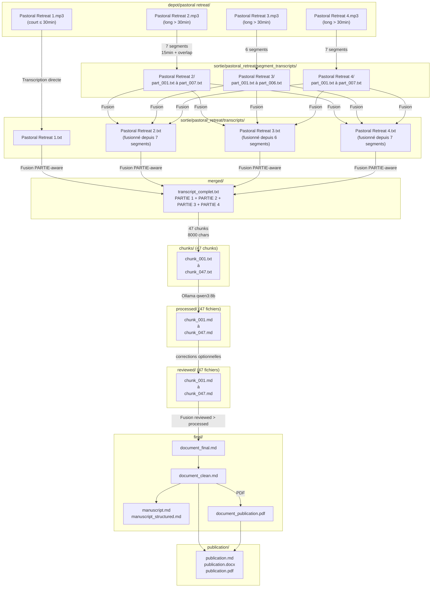

# Flux de données — PublishForge

## 1. Diagramme principal : Audio → Publication

```mermaid
flowchart LR
    subgraph INPUT["📥 Entrée\ndepot/<projet>/"]
        D1["*.mp3\n*.ogg\n*.wav\n*.m4a"]
        D2["prompt.md\n(optionnel)"]
    end

    subgraph TRANS["🎤 Transcription\nsortie/<projet>/"]
        T1["audio_segments/<stem>/\npart_001.mp3\n...\npart_NNN.mp3"]
        T2["segment_transcripts/<stem>/\npart_001.txt\n...\npart_NNN.txt"]
        T3["transcripts/\nNomFichier_1.txt\nNomFichier_2.txt\n..."]
    end

    subgraph MERGE["🔗 Fusion"]
        M1["merged/\ntranscript_complet.txt\nFormat PARTIE-aware"]
    end

    subgraph CHUNK["✂️ Chunking"]
        C1["chunks/\nchunk_001.txt\nchunk_002.txt\n...\nchunk_NNN.txt"]
        C2["chunks/obsolete/\n(chunks périmés)"]
    end

    subgraph AI["🤖 IA"]
        A1["processed/\nchunk_001.md\nchunk_002.md\n...\nchunk_NNN.md"]
        A2["errors/\nchunk_XXX.error.txt\n(erreurs traceback)"]
    end

    subgraph REVIEW["📝 Révision"]
        R1["corrections/\nchunk_NNN.corrections.md\n(timestamp + texte actuel\n+ texte corrigé)"]
        R2["reviewed/\nchunk_001.md\n...\nchunk_NNN.md\n(corrigé ou copie)"]
    end

    subgraph FINAL["📄 Document final"]
        F1["final/\ndocument_final.md\n(interne, structure visible)"]
        F2["final/\ndocument_clean.md\n(publiable, sans artefacts)"]
        F3["harmonized/\ndocument_harmonized.md\n(optionnel)"]
    end

    subgraph COVER["🎨 Couverture"]
        COV1["cover/\ncover.jpg\ncover.png\ncover_metadata.json"]
    end

    subgraph PUB["📖 Publication"]
        P1["publication/\npublication.md\npublication.docx\npublication.pdf"]
    end

    subgraph EXPORTS["📤 Exports finaux"]
        E1["final/\ndocument_final.docx"]
        E2["final/\ndocument_publication.pdf"]
    end

    subgraph CLIENT["📦 Livraison"]
        Z1["client/\n<projet>_CLIENT.zip\n(PDF + DOCX + cover)"]
    end

    subgraph AUDIT["📊 Audit & État"]
        S1["project_state.json\n(machine d'état JSON)"]
        S2["report.json\n(rapport projet)"]
        S3["logs/run_YYYYMMDD.json\n(log d'exécution)"]
    end

    D1 -->|"Durée > 30min\nffmpeg découpage"| T1
    T1 -->|"faster-whisper\npar segment"| T2
    T2 -->|"Fusion segments\ntimestamps globaux"| T3
    D1 -->|"Durée ≤ 30min\ntranscription directe"| T3

    T3 -->|"transcript_merger\nAjout en-têtes PARTIE"| M1

    M1 -->|"chunk_service\n8000 chars max\nPARTIE-aware"| C1
    C1 -.->|"Obsolètes déplacés"| C2

    C1 -->|"ai_processor + LLM\nclean_transcript prompt"| A1
    D2 -.->|"Prompt personnalisé\ndepot/<projet>/prompt.md"| A1
    C1 -->|"Erreur LLM"| A2

    A1 -->|"correction_review_service\nParse timestamps"| R1
    R1 -.->|"Révision humaine\noptionnelle"| R1
    R1 -->|"correction_apply_service\nRemplacement first occurrence"| R2
    A1 -->|"Sans corrections\nCopie directe"| R2

    R2 -->|"Priorité reviewed > processed\nfinal_document_builder"| F1
    A1 -->|"Si pas de reviewed"| F1
    F1 --> F2
    F2 -->|"global_editor\noptionnel"| F3

    F2 & F3 -->|"cover_generation_service\nStratégie: user/généré/typo"| COV1
    F2 & F3 -->|"publication_template_service"| P1

    F1 -->|"docx_export_service"| E1
    F2 -->|"pdf_export_service"| E2

    P1 -->|"publication_docx_engine"| P1
    P1 -->|"publication_pdf_engine"| P1
    COV1 -.->|"Incluse dans\nle PDF"| P1

    E1 & E2 & P1 & COV1 -->|"client_export_service\nZIP"| Z1

    S1 -.->|"Lu/Écrit après\nchaque opération"| T3 & T2 & A1 & R2 & F1
    S2 -.->|"report_service"| F1
    S3 -.->|"production_service"| Z1
```



---

## 2. Structure détaillée des dossiers et fichiers

### Entrée — `depot/`

```
depot/
├── <projet>/                   ← Un dossier par projet
│   ├── *.mp3                   ← Fichiers audio sources
│   ├── *.ogg
│   ├── *.wav
│   ├── *.m4a
│   └── prompt.md               ← Prompt IA personnalisé (optionnel)
│                                 Format: texte avec placeholder {{TEXT}}
└── *.mp3 / *.ogg / ...         ← Fichiers audio racine → projet "default"
```

---

### Sortie — `sortie/<projet>/`

#### Niveau racine

| Fichier | Producteur | Description |
|---------|------------|-------------|
| `project_state.json` | `project_state.py` | Machine d'état JSON complète du projet |
| `report.json` | `report_service.py` | Rapport de synthèse du dernier run |
| `orchestrator_report.md` | `publication_orchestrator.py` | Rapport du pipeline publication |

#### `transcripts/` — Transcriptions individuelles

| Fichier | Format | Producteur |
|---------|--------|------------|
| `NomFichier.txt` | `[HH:MM:SS -> HH:MM:SS] texte` | `transcription_service.py` ou `segmented_transcription_service.py` |

**Exemple de contenu :**
```
[00:00:05 -> 00:00:12] Welcome, everyone, to this pastoral retreat.
[00:00:12 -> 00:00:18] Today we will be exploring the themes of grace and renewal.
```

#### `segment_transcripts/<stem>/` — Segments de longue transcription

| Fichier | Description |
|---------|-------------|
| `part_001.txt` | Transcript du segment 1 (timestamps globaux) |
| `part_NNN.txt` | Transcript du segment N |

**Présent uniquement pour les fichiers > 30 minutes.**

#### `audio_segments/<stem>/` — Segments audio découpés

| Fichier | Format | Producteur |
|---------|--------|------------|
| `part_001.mp3` | MP3 (libmp3lame q:a 2) | `segmented_transcription_service._create_audio_segment()` via ffmpeg |

#### `merged/` — Transcript fusionné

| Fichier | Description |
|---------|-------------|
| `transcript_complet.txt` | Fusion de tous les transcripts avec en-têtes PARTIE |

**Structure :**
```
=====
PARTIE 1 — NomFichier_1
=====
[00:00:05 -> 00:00:12] ...

=====
PARTIE 2 — NomFichier_2
=====
[01:23:45 -> 01:23:52] ...
```

#### `chunks/` — Chunks de texte bruts

| Fichier | Taille max | Producteur |
|---------|-----------|------------|
| `chunk_001.txt` à `chunk_NNN.txt` | 8000 caractères | `chunk_service.py` |
| `obsolete/chunk_*.txt` | — | Chunks périmés déplacés ici |

**Structure d'un chunk :**
```
# Partie source : PARTIE 2 — NomFichier_2

[01:23:45 -> 01:23:52] texte du segment...
[01:23:52 -> 01:24:10] suite du texte...
```

#### `processed/` — Chunks traités par l'IA

| Fichier | Format | Producteur |
|---------|--------|------------|
| `chunk_001.md` à `chunk_NNN.md` | Markdown éditorial | `ai_processor.py` via LLM |
| `obsolete/chunk_*.md` | — | Traités périmés déplacés ici |

**Structure d'un chunk traité :**
```markdown
# Titre de section détecté par l'IA

## Introduction

Paragraphe fluide issu de la transcription brute...

## Développement

Suite du contenu structuré...
```

#### `errors/` — Erreurs de traitement IA

| Fichier | Description |
|---------|-------------|
| `chunk_NNN.error.txt` | Traceback complet + extrait prompt + horodatage |

#### `corrections/` — Fichiers de révision humaine

| Fichier | Format |
|---------|--------|
| `chunk_NNN.corrections.md` | Markdown structuré avec blocs Correction + timestamps |

**Workflow :** Généré automatiquement → modifié par l'humain → appliqué automatiquement

#### `reviewed/` — Chunks après corrections

| Fichier | Source |
|---------|--------|
| `chunk_001.md` à `chunk_NNN.md` | processed/ + corrections appliquées (ou copie directe) |

#### `final/` — Documents finaux fusionnés

| Fichier | Description | Producteur |
|---------|-------------|------------|
| `document_final.md` | Version interne — structure de chunks visible | `final_document_builder.py` |
| `document_clean.md` | Version publiable — sans artefacts ni métadonnées | `final_document_builder.py` |
| `document_final.docx` | Export DOCX du document final | `docx_export_service.py` |
| `document_publication.pdf` | Export PDF de la publication | `pdf_export_service.py` |

#### `harmonized/` — Document harmonisé (optionnel)

| Fichier | Description |
|---------|-------------|
| `document_harmonized.md` | Version harmonisée par LLM (si `GLOBAL_EDITOR_ENABLED=True`) |

#### `cover/` — Couverture

| Fichier | Description |
|---------|-------------|
| `cover.jpg` | Image de couverture (JPEG) |
| `cover.png` | Image de couverture (PNG, si Pillow disponible) |
| `cover_metadata.json` | Métadonnées : style, stratégie, prompt utilisé, dimensions |

#### `publication/` — Publication finale

| Fichier | Description |
|---------|-------------|
| `publication.md` | Markdown publication avec template et métadonnées |
| `publication.docx` | DOCX éditorial final |
| `publication.pdf` | PDF éditorial final avec couverture |

#### `client/` — Package client

| Fichier | Contenu |
|---------|---------|
| `<projet>_CLIENT.zip` | publication.pdf + publication.docx + cover.jpg |

---

### Dossiers système

#### `temp/` — Fichiers temporaires

Utilisé par l'ancien pipeline (`transcribe_file()`) pour les fichiers audio en cours de traitement.  
**Peut être vidé sans impact sur les projets terminés.**

#### `archives/` — Audio archivés

Les fichiers audio sont déplacés ici après transcription (ancien pipeline `transcribe_file()`).  
Le nouveau pipeline (`pipeline_runner.py`) ne déplace pas les fichiers audio.

#### `rejets/` — Audio rejetés

Fichiers audio rejetés car corrompus ou vides (taille 0 octets).

#### `logs/` — Logs d'exécution

| Fichier | Contenu |
|---------|---------|
| `run_YYYYMMDD_HHMMSS.json` | Résumé d'un run : projets, durées, statuts, erreurs |

---

## 3. Flux de données pour un projet réel (pastoral_retreat)



---

## 4. Tableau récapitulatif des formats de fichiers

| Dossier | Extension | Encodage | Format interne |
|---------|-----------|----------|---------------|
| `depot/` | `.mp3` `.ogg` `.wav` `.m4a` | Binaire | Audio |
| `transcripts/` | `.txt` | UTF-8 | `[HH:MM:SS -> HH:MM:SS] texte` |
| `segment_transcripts/` | `.txt` | UTF-8 | `[HH:MM:SS -> HH:MM:SS] texte` |
| `audio_segments/` | `.mp3` | Binaire | MP3 libmp3lame |
| `merged/` | `.txt` | UTF-8 | Texte libre + en-têtes PARTIE |
| `chunks/` | `.txt` | UTF-8 | Texte brut (timestamps conservés) |
| `processed/` | `.md` | UTF-8 | Markdown éditorial |
| `errors/` | `.txt` | UTF-8 | Texte structuré (erreur + traceback) |
| `corrections/` | `.md` | UTF-8 | Markdown structuré (blocs Correction) |
| `reviewed/` | `.md` | UTF-8 | Markdown éditorial (corrigé) |
| `final/` | `.md` `.docx` `.pdf` | UTF-8 / Binaire | Markdown, DOCX python-docx, PDF |
| `harmonized/` | `.md` | UTF-8 | Markdown éditorial harmonisé |
| `cover/` | `.jpg` `.png` `.json` | Binaire / UTF-8 | JPEG, PNG, JSON métadonnées |
| `publication/` | `.md` `.docx` `.pdf` | UTF-8 / Binaire | Markdown, DOCX, PDF |
| `client/` | `.zip` | Binaire | ZIP (PDF + DOCX + JPEG) |
| `project_state.json` | `.json` | UTF-8 | JSON indent=2 |
| `report.json` | `.json` | UTF-8 | JSON indent=2 |
| `logs/` | `.json` | UTF-8 | JSON indent=2 |
