# Modules — Cartographie et descriptions

## 1. Diagramme global des dépendances

```mermaid
graph TD
    subgraph ENTRY["🚀 Points d'entrée"]
        MAIN["main.py\nCLI argparse\n+ menu interactif"]
        STREAM["streamlit_app.py\nUI Streamlit\n8 pages"]
    end

    subgraph ORCH["⚙️ Orchestration"]
        PROD["production_service.py\nFaçade haut niveau\nprocess_all / process_project\nresume / rebuild"]
        PIPE["pipeline_runner.py\nrun_project_pipeline\nrun_full_rebuild_pipeline\nrun_exports_only\nrun_report_only"]
        PUBORG["publication_orchestrator.py\ngenerate_complete_client_package\n8 étapes éditorial → livraison"]
    end

    subgraph FOUND["🏗️ Fondation"]
        PM["project_manager.py\nDiscover / AudioProject\ncreate_project\nensure_directories"]
        PS["project_state.py\nload / save\nmark_audio_* / update_chunk\nforce_reset / update_metadata"]
        CFG["config.py\nWhisper MODEL_NAME DEVICE\nAI_PROVIDER AI_TASK\nOLLAMA_* LMSTUDIO_* OPENAI_*\nCOVER_* GLOBAL_EDITOR_*"]
        PATHS["paths.py\nDEPOT_DIR SORTIE_DIR\nTEMP_DIR ARCHIVES_DIR\nLOGS_DIR REJETS_DIR"]
        LOG["logger.py\nlog_event()"]
        FILE["file_utils.py\nfile_hash sanitize_name\ncontent_hash\nwrite_text_if_changed\nunique_path"]
        AUDIO["audio_utils.py\nget_audio_duration_seconds\nformat_timestamp split_audio\nprint_progress FFMPEG_EXE"]
        SLEEP["sleep_guard.py\nprevent_sleep\nallow_sleep_again"]
        PROMUT["prompt_utils.py\nrender_prompt()\nSubstitution sécurisée {{TEXT}}"]
    end

    subgraph TRANS["🎤 Transcription"]
        TS["transcription_service.py\ntranscribe_audio_to_txt()\nDétection langue fr/en"]
        STS["segmented_transcription_service.py\ntranscribe_long_audio_with_segments()\nshould_segment_audio()\nReprise par hash + segment"]
        TM["transcript_merger.py\nmerge_project_transcripts()\nEn-têtes PARTIE N"]
    end

    subgraph CHUNK["✂️ Chunking"]
        CS["chunk_service.py\ncreate_project_chunks()\nparse_transcript_into_partie_blocks()\nsplit_text_into_chunks()\nvalidate_chunk_content()\nis_real_transcript_content()\nwrite_text_if_changed()"]
    end

    subgraph AI_GROUP["🤖 Intelligence artificielle"]
        AIPROC["ai_processor.py\nprocess_project_chunks()\nprocess_single_chunk()\nLogique de saut\n(done/skipped_empty/pending_ai)"]
        AIENG["ai_engine.py\nBaseAIEngine ABC\nget_ai_engine() factory"]
        OLLAMA["OllamaEngine\nPOST /api/generate\nqwen3:8b local"]
        LMST["LMStudioEngine\nPOST /v1/chat/completions\nOpenAI-compatible"]
        OAPI["OpenAIEngine\nopenai SDK\ngpt-4o-mini cloud"]
        FAKE["FakeAIEngine\nSimulation\ntests uniquement"]
        PROMM["prompt_manager.py\nbuild_prompt()\nget_project_prompt()\nget_prompt_template()\n8 templates intégrés"]
    end

    subgraph REV_GROUP["📝 Révision humaine"]
        CRS["correction_review_service.py\ngenerate_review_files()\nParse timestamps\nGénère .corrections.md\nNe jamais écraser"]
        CAS["correction_apply_service.py\napply_corrections()\n_parse_corrections()\n_apply_corrections_to_content()\nreviewed/ prioritaire"]
    end

    subgraph BUILD_GROUP["📄 Construction document"]
        FDB["final_document_builder.py\nbuild_final_document()\nlist_effective_chunks()\ncompute_effective_signature()\ndocument_final.md + document_clean.md"]
        GES["global_editor_service.py\nharmonize_document()\nMode light/medium/aggressive\nOptionnel (GLOBAL_EDITOR_ENABLED)"]
        PTS["publication_template_service.py\nbuild_publication_markdown()\nInjecte métadonnées dans le MD"]
        PB["publication_builder.py\nbuild_publication()"]
        PSAN["publication_sanitizer.py\ngenerate_sanitized_publication()"]
        ET["editorial_transformer.py\ntransform_editorial_manuscript()"]
        EQG["editorial_quality_guard.py\nrun_editorial_quality_guard()"]
        PQS["publication_quality_service.py\nvalidate_and_update_state()\nValidation livrables post-pipeline"]
    end

    subgraph EXP_GROUP["📤 Exports"]
        DOCX["docx_export_service.py\nexport_docx()\nexport_publication_docx()"]
        PDF["pdf_export_service.py\nexport_pdf()\nexport_publication_pdf()"]
        PDOCX["publication_docx_engine.py\ngenerate_publication_docx()"]
        PPDF["publication_pdf_engine.py\ngenerate_publication_pdf()"]
        ZIP["client_export_service.py\nexport_client_zip()\nCollecte PDF+DOCX+cover"]
        CP["client_package.py\nbuild_client_package()"]
    end

    subgraph COV_GROUP["🎨 Couvertures"]
        CGS["cover_generation_service.py\ngenerate_cover()\nresolve_cover_strategy()\nCache intelligent par hash"]
        CB["cover_builder.py\ngenerate_cover()"]
        CIE["cover_image_engine.py\nGénération images\nDALL-E / SDXL / Fake"]
        CLS["cover_layout_service.py\nget_standard_cover_pixels()\nlettre/A4/digest/6x9\n300 DPI"]
        IMGSVC["image_engine/image_service.py\nimage_prompt_builder\nsdxl_provider"]
    end

    subgraph RPT_GROUP["📊 Rapport"]
        REP["report_service.py\nbuild_project_report()"]
        UISTAT["ui_status_service.py\nget_all_projects_status()\nget_project_status()\nStatuts: success/running/error/interrupted/partial"]
    end

    subgraph UI_GROUP["🖥️ Interface Streamlit"]
        DASH["page_dashboard.py\nStatut global\nActions rapides"]
        META["page_metadata.py\nÉdition project.yaml\nmetadata_editor_service"]
        EDIT["page_editorial.py\nLancement pipeline\nÉtat chunks IA"]
        PUB2["page_publication.py\nGénération publication"]
        PCOV["page_cover.py\nGénération/sélection\ncouverture"]
        DOCXP["page_docx_pdf.py\nExports DOCX/PDF"]
        PKG["page_client_package.py\nGénération ZIP\nTéléchargement"]
        SET["page_settings.py\nConfiguration\nparamètres app"]
    end

    %% Connexions principales
    MAIN --> PROD
    STREAM --> PROD
    STREAM --> PUBORG
    STREAM --> UI_GROUP

    PROD --> PIPE
    PROD --> PM
    PROD --> SLEEP

    PIPE --> TS & STS & TM
    PIPE --> CS
    PIPE --> AIPROC
    PIPE --> CRS & CAS
    PIPE --> FDB & GES & PTS
    PIPE --> DOCX & PDF & PDOCX & PPDF
    PIPE --> ZIP
    PIPE --> CGS
    PIPE --> REP
    PIPE --> PQS

    PUBORG --> ET & EQG & PB & PSAN & CB & PDOCX & PPDF & CP

    AIPROC --> AIENG
    AIENG --> OLLAMA & LMST & OAPI & FAKE
    AIPROC --> PROMM
    AIENG --> PROMM
    PROMM --> PROMUT

    CGS --> CB & CIE & CLS
    CIE --> IMGSVC

    TS --> PS & LOG & AUDIO & FILE
    STS --> PS & LOG & AUDIO & FILE
    TM --> LOG
    CS --> PS & FILE
    AIPROC --> PS & LOG
    CRS --> PS
    CAS --> PS
    FDB --> PS
    GES --> PS
    REP --> PS
    CGS --> PS

    PM --> PATHS & FILE
    PS --> PATHS
    PROD --> LOG
    PIPE --> LOG

    STREAM --> UISTAT
    UISTAT --> PS

    CFGLINK["config.py"] -->|importé par| TS & STS & CS & AIENG & CGS & CLS

    style ENTRY fill:#0d1b2a,stroke:#4a9edd,color:#fff
    style ORCH fill:#1a0d2e,stroke:#9a4add,color:#fff
    style FOUND fill:#0d2a1a,stroke:#4add9a,color:#fff
    style TRANS fill:#2a1a0d,stroke:#dd9a4a,color:#fff
    style CHUNK fill:#2a0d1a,stroke:#dd4a9a,color:#fff
    style AI_GROUP fill:#1a2a0d,stroke:#9add4a,color:#fff
    style REV_GROUP fill:#0d2a2a,stroke:#4adddd,color:#fff
    style BUILD_GROUP fill:#2a2a0d,stroke:#dddd4a,color:#fff
    style EXP_GROUP fill:#0d0d2a,stroke:#4a4add,color:#fff
    style COV_GROUP fill:#2a0d2a,stroke:#dd4add,color:#fff
    style RPT_GROUP fill:#1a2a1a,stroke:#8add8a,color:#fff
    style UI_GROUP fill:#1a1a2a,stroke:#8a8add,color:#fff
```



---

## 2. Description détaillée de chaque module

### Couche Fondation

---

#### `app/config.py`
**Rôle :** Configuration globale centralisée.  
**Responsabilités :**
- Paramètres moteur Whisper : `MODEL_NAME="large-v3"`, `DEVICE="cpu"`
- Extensions supportées : `{".ogg", ".mp3", ".wav", ".m4a"}`
- Langues autorisées : `{"en", "fr"}`
- Segmentation longue durée : seuils, durées, overlap
- Fournisseur IA et modèles : `AI_PROVIDER`, `OLLAMA_MODEL`, etc.
- Paramètres couvertures : style, provider, DPI
- Harmonisation éditoriale : activation et mode

**Dépendances entrantes :** pratiquement tous les modules

---

#### `app/paths.py`
**Rôle :** Centralise tous les chemins absolus du système.  
**Variables exportées :**
```python
BASE_DIR    = Path(__file__).resolve().parent.parent
DEPOT_DIR   = BASE_DIR / "depot"
SORTIE_DIR  = BASE_DIR / "sortie"
TEMP_DIR    = BASE_DIR / "temp"
ARCHIVES_DIR = BASE_DIR / "archives"
LOGS_DIR    = BASE_DIR / "logs"
REJETS_DIR  = BASE_DIR / "rejets"
```

---

#### `app/project_manager.py`
**Rôle :** Découverte et instanciation des projets.  
**Classe centrale :**
```python
@dataclass
class AudioProject:
    name: str           # Nom sanitisé (ex. "pastoral_retreat")
    source_dir: Path    # depot/<projet>/
    audio_files: list[Path]
    output_dir: Path    # sortie/<projet>/
    transcripts_dir: Path
    merged_dir: Path
    book_dir: Path
    pdf_dir: Path
    temp_dir: Path
    archives_dir: Path
    rejects_dir: Path
```

**Fonctions clés :**
- `discover_projects()` : scanne `depot/` — fichiers racine → projet "default", sous-dossiers → projets nommés
- `create_project(name, source_dir, audio_files)` : construit `AudioProject` + crée les dossiers
- `ensure_project_directories(project)` : `mkdir(parents=True, exist_ok=True)` sur tous les dossiers

---

#### `app/project_state.py`
**Rôle :** Machine d'état JSON persistante — le cœur de la reprise après interruption.  
**Fichier géré :** `sortie/<projet>/project_state.json`

**Fonctions clés :**

| Fonction | Rôle |
|----------|------|
| `load_project_state(project_name)` | Lit JSON + initialise les sections manquantes |
| `save_project_state(project_name, state)` | Écrit JSON avec `indent=2` |
| `ensure_state_structure(state)` | Garantit la présence de toutes les clés |
| `is_audio_already_transcribed(...)` | Vérifie hash + status + fichier présent |
| `mark_audio_processing(...)` | Status → "processing" |
| `mark_audio_transcribed(...)` | Status → "transcribed" |
| `mark_audio_failed(...)` | Status → "failed" |
| `mark_audio_processing_segments(...)` | Status → "processing_segments" + liste segments |
| `update_segment_in_state(...)` | Met à jour un segment individuel |
| `mark_audio_segmented_transcribed(...)` | Fichier long → "transcribed" avec audit segments |
| `mark_audio_partial_error(...)` | Erreur partielle avec segments préservés |
| `update_chunk_state(...)` | Met à jour l'entrée d'un chunk avec hash + status |
| `mark_chunk_done(...)` | Status chunk → "done" |
| `is_chunk_done(...)` | Prédicat statut chunk |
| `reset_chunk_for_reprocessing(...)` | Un chunk → "pending" |
| `reset_all_chunks_for_reprocessing(...)` | Tous les chunks → "pending" |
| `force_reset_project_for_rebuild(...)` | Réinitialise sections chunks/final/publication/exports |
| `update_metadata_state(...)` | Marque les flags needs_*_rebuild après édition YAML |

---

#### `app/file_utils.py`
**Rôle :** Utilitaires de gestion de fichiers.

| Fonction | Description |
|----------|-------------|
| `file_hash(path)` | MD5 du contenu binaire d'un fichier |
| `content_hash(text)` | SHA256 d'une chaîne UTF-8 |
| `sanitize_name(name)` | Remplace espaces → underscores, retire accents |
| `unique_path(dir, stem, suffix)` | Chemin unique sans collision (ajoute `_01`, `_02`...) |
| `write_text_if_changed(path, text)` | Écrit si contenu différent — retourne "created"/"updated"/"unchanged" |

---

#### `app/audio_utils.py`
**Rôle :** Utilitaires audio basés sur ffmpeg.

| Fonction | Description |
|----------|-------------|
| `get_audio_duration_seconds(path)` | Durée en secondes via ffprobe/PyAV |
| `format_timestamp(seconds)` | Formate en HH:MM:SS ou MM:SS |
| `print_progress(current, total, start_time, prefix)` | Barre de progression console |
| `split_audio(source, output_dir)` | Découpe en segments (ancien pipeline) |
| `FFMPEG_EXE` | Chemin vers l'exécutable ffmpeg |

---

#### `app/prompt_manager.py`
**Rôle :** Gestion des templates de prompts IA.

**8 tâches intégrées :**

| Tâche | Description |
|-------|-------------|
| `clean_transcript` | Correction + structuration Markdown d'une transcription brute **(défaut)** |
| `summary` | Résumé structuré avec sujet + idées + conclusion |
| `book_chapter` | Transformation en chapitre de livre publiable |
| `key_points` | Extraction des idées principales et concepts |
| `classification` | Classification documentaire (type, thèmes, public) |
| `global_harmonization_light` | Harmonisation légère (titres, ponctuation, transitions) |
| `global_harmonization_medium` | Harmonisation moyenne (fluidité, répétitions) |
| `global_harmonization_aggressive` | Révision complète du document entier |

**Priorité des prompts :**
1. `depot/<projet>/prompt.md` si présent (surcharge totale)
2. Template de `AI_TASK` dans `config.py`
3. Fallback : `clean_transcript`

**Placeholder :** `{{TEXT}}` (double accolades — ne jamais utiliser `.format()`)

---

### Couche Transcription

---

#### `app/transcription_service.py`
**Rôle :** Transcription directe d'un fichier audio via faster-whisper.

**Fonction principale :** `transcribe_audio_to_txt(model, audio_path, output_path, total_duration_seconds, timestamp_offset=0)`

**Comportement :**
- Appel `model.transcribe(audio_path)` → itérateur de segments
- Détection langue — si hors `ALLOWED_LANGUAGES` : forçage vers "en"
- Formatage : `[HH:MM:SS -> HH:MM:SS] texte du segment`
- Affichage progression en temps réel

---

#### `app/segmented_transcription_service.py`
**Rôle :** Transcription robuste des longs fichiers audio avec reprise après interruption.

**Fonction principale :** `transcribe_long_audio_with_segments(model, project_name, audio_path, output_path)`

**Mécanismes de reprise :**
- Hash MD5 du fichier audio pour détecter les modifications
- Restauration des segments déjà transcrits depuis `project_state.json`
- Sauvegarde immédiate après chaque segment transcrit
- Gestion erreurs partielles : segments OK préservés, erreurs stockées

**Overlap :** Chaque segment chevauche de 10 secondes le suivant. Les phrases dont le timestamp de fin est ≤ `effective_start_local` sont ignorées lors de la transcription (dédoublonnage).

---

#### `app/transcript_merger.py`
**Rôle :** Fusionne les fichiers de transcriptions individuels en un seul document.

**Sortie :** `merged/transcript_complet.txt`  
**Format :** Intercale des en-têtes `=====\nPARTIE N — NomFichier\n=====` entre les fichiers.

---

### Couche Chunking

---

#### `app/chunk_service.py`
**Rôle :** Découpe le transcript fusionné en chunks optimaux pour le traitement IA.

**Paramètres :**
- `max_chars = 8000` (limite context window Whisper avec marge)

**Algorithme PARTIE-aware :**
1. `parse_transcript_into_partie_blocks(text)` — détecte les blocs PARTIE (`=====\nPARTIE N\n=====`)
2. Pour chaque bloc : `split_text_into_chunks(content, max_chars=8000)`
3. Priorité de coupure : séparateurs `===`/`---` → timestamps → double saut de ligne → saut simple
4. Filtrage : `is_real_transcript_content()` — ignore les blocs de timestamps seuls ou métadonnées

**Gestion des chunks obsolètes :** Les fichiers `chunk_NNN.txt` au-delà du nouveau total sont déplacés vers `chunks/obsolete/`.

**Idempotence :** `write_text_if_changed()` — un chunk n'est réécrit que si son contenu a changé.  
**Statuts retournés :** `created` | `updated` | `unchanged`

---

### Couche IA

---

#### `app/ai_engine.py`
**Rôle :** Abstraction des moteurs LLM via le pattern Strategy.

```
BaseAIEngine (ABC)
    ├── send_prompt(prompt: str) -> str     # ABSTRACT — transport HTTP
    ├── build_prompt(text, project_name)    # Construit le prompt final
    └── process(text, project_name)        # Orchestre build + send

OllamaEngine(BaseAIEngine)
    └── POST http://localhost:11434/api/generate
        payload: {model, prompt, stream:false, options:{temperature:0.2, num_ctx:4096}}

LMStudioEngine(BaseAIEngine)
    └── POST http://localhost:1234/v1/chat/completions
        payload: {model, messages:[{role:user, content:prompt}], temperature:0.2}

OpenAIEngine(BaseAIEngine)
    └── openai.ChatCompletions.create(model="gpt-4o-mini", messages=...)
        Import différé — openai SDK optionnel

FakeAIEngine(BaseAIEngine)
    └── Retourne le contenu original encadré d'un message simulé
        Aucune dépendance externe
```

**Factory :** `get_ai_engine()` → lit `AI_PROVIDER` dans `config.py`

---

#### `app/ai_processor.py`
**Rôle :** Orchestre le traitement IA de tous les chunks d'un projet.

**Logique de décision par chunk :**

```
status == "skipped_empty"                     → SKIP (contenu vide)
status == "done" + !needs_ai + processed.md   → SKIP (déjà traité, inchangé)
!needs_ai + processed.md existe               → Mise à jour status → "done", SKIP
Tout autre cas                                → TRAITEMENT IA
```

**Robustesse :**
- Filtre les chunks vides avant envoi au LLM (`is_real_transcript_content()`)
- Supprime les en-têtes de métadonnées avant envoi (`_strip_chunk_metadata_header()`)
- Écrit un fichier d'erreur détaillé dans `errors/` en cas d'échec
- Continue le traitement des autres chunks même si l'un échoue
- Sauvegarde `project_state.json` après chaque chunk

---

### Couche Révision

---

#### `app/correction_review_service.py`
**Rôle :** Génère automatiquement les fichiers de révision pour les correcteurs humains.

**Sortie :** `corrections/chunk_NNN.corrections.md`

**Format généré :**
```markdown
# Corrections du chunk_NNN

---

## Correction 1

### Timestamp
00:09 → 00:23

### Texte actuel
Le texte transcrit par Whisper.

### Texte corrigé
[À COMPLÉTER]
```

**Important :** Ne jamais écraser un fichier existant (reprise après interruption).

---

#### `app/correction_apply_service.py`
**Rôle :** Applique les corrections humaines sur les chunks traités.

**Entrée :** `corrections/chunk_NNN.corrections.md` (modifié par l'humain)  
**Sortie :** `reviewed/chunk_NNN.md`

**Logique :**
- Parse les blocs `## Correction N`
- Ignore les blocs `[À COMPLÉTER]` ou vides
- Applique le remplacement sur la première occurrence dans `processed/chunk_NNN.md`
- Si aucune correction valide → copie directe de `processed/` vers `reviewed/`
- Détection des modifications via mtime (pas de retraitement si `reviewed/` plus récent)

---

### Couche Construction document

---

#### `app/final_document_builder.py`
**Rôle :** Fusionne tous les chunks en deux documents finaux.

**Priorité des sources :** `reviewed/chunk_NNN.md` > `processed/chunk_NNN.md`

**Produit :**
- `final/document_final.md` — version interne avec structure de chunks visible
- `final/document_clean.md` — version publiable après `clean_publication_markdown()`

**Idempotence :** Signature SHA256 de chaque fichier source. Si identique → skip.

---

#### `app/global_editor_service.py`
**Rôle :** Harmonisation éditoriale optionnelle du document entier via LLM.

**Activé par :** `GLOBAL_EDITOR_ENABLED = True` dans `config.py`  
**Modes :** `light` | `medium` | `aggressive`  
**Sortie :** `harmonized/document_harmonized.md`

---

#### `app/publication_template_service.py`
**Rôle :** Applique le template de publication sur le document clean.

**Sortie :** `publication/publication.md`

---

### Couche Exports

---

#### `app/docx_export_service.py`
**Rôle :** Export DOCX via `python-docx`.

**Fonctions :**
- `export_docx(project_name)` → `final/document_final.docx`
- `export_publication_docx(project_name)` → `publication/publication.docx`

---

#### `app/pdf_export_service.py`
**Rôle :** Export PDF.

**Fonctions :**
- `export_pdf(project_name)` → `final/document_publication.pdf`
- `export_publication_pdf(project_name)` → `publication/publication.pdf`

---

#### `app/cover_generation_service.py`
**Rôle :** Gestion intelligente de la génération de couvertures.

**Stratégies résolues par `resolve_cover_strategy()` :**

| Priorité | Stratégie | Condition |
|----------|-----------|-----------|
| 1 | `type="image", source="user"` | `cover_image` ≠ "auto"/"none" ET fichier présent |
| 2 | `type="image", source="generated"` | `document_type` dans `_IMAGE_DOC_TYPES` (livret, livre, formation...) |
| 3 | `type="typography", source="typography"` | `document_type` dans `_TYPOGRAPHY_DOC_TYPES` (rapport, réunion) |

**Cache :** Hash du contenu du prompt de couverture — régénère uniquement si changé.

---

#### `app/client_export_service.py`
**Rôle :** Crée le package ZIP de livraison client.

**Contenu du ZIP :** `publication.pdf` + `publication.docx` + `cover.jpg`  
**Sortie :** `client/<projet>_CLIENT.zip`

---

### Couche Rapport

---

#### `app/report_service.py`
**Rôle :** Génère le rapport JSON de synthèse du projet.

**Sortie :** `sortie/<projet>/report.json`

---

#### `app/ui_status_service.py`
**Rôle :** Calcule le statut visuel d'un projet pour l'interface Streamlit.

**Statuts calculés :**

| Statut | Condition |
|--------|-----------|
| `success` | `execution.status == "success"` |
| `running` | `execution.status == "running"` |
| `error` | `execution.status == "error"` |
| `interrupted` | `execution.status == "running"` + heartbeat trop ancien |
| `partial` | `execution.status == "partial"` |
| `pending` | Pas de section `execution` |
| `unknown` | Pas de `project_state.json` |

---

### Interface Streamlit (`app/ui/`)

---

#### `page_dashboard.py`
Vue d'ensemble : statut global du projet, progression des étapes, actions rapides (lancer pipeline, rebuild, exports).

#### `page_metadata.py`
Éditeur de `project.yaml` : titre, auteur, description, langue, mode, ISBN, cover_image. Appelle `metadata_editor_service` pour persister et mettre à jour les flags `needs_*_rebuild`.

#### `page_editorial.py`
Interface du pipeline éditorial : lancement du traitement IA, visualisation des chunks (status par status), retraitement individuel de chunks.

#### `page_publication.py`
Déclenchement de la publication complète via `publication_orchestrator`. Affichage des étapes en temps réel via `progress_callback`.

#### `page_cover.py`
Génération et prévisualisation de la couverture. Sélection de l'image utilisateur ou génération automatique. Paramètres de style et format.

#### `page_docx_pdf.py`
Export et téléchargement des fichiers DOCX et PDF depuis l'interface.

#### `page_client_package.py`
Génération du package ZIP client et bouton de téléchargement.

#### `page_settings.py`
Configuration application : provider IA, modèle, URLs, paramètres de segmentation, mode d'harmonisation.
