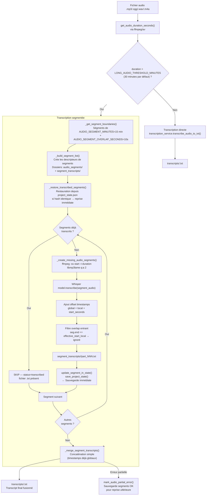
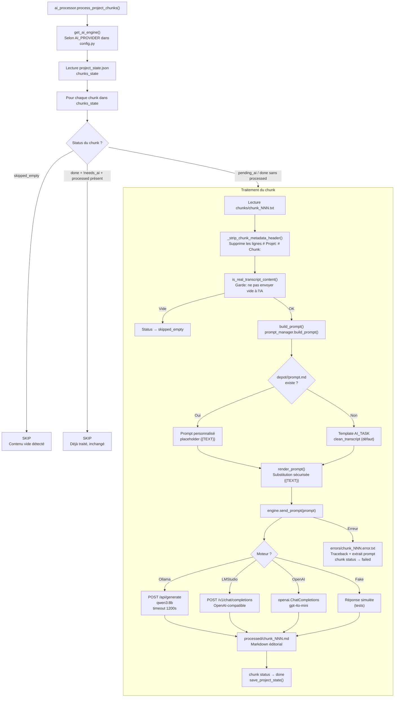
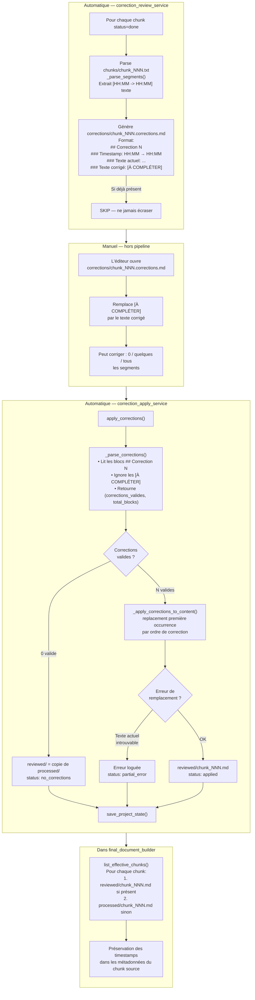
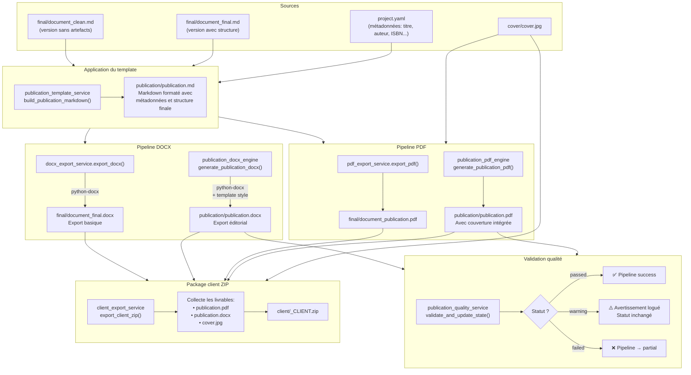
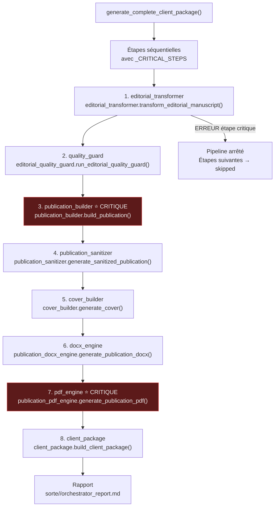

# Pipeline Global — PublishForge

## Vue d'ensemble des modes d'exécution

| Mode | Fonction | Étapes couvertes |
|------|----------|-----------------|
| Pipeline complet | `run_project_pipeline()` | 1 → 16 |
| Rebuild depuis chunks | `run_full_rebuild_pipeline()` | 3 → 16 |
| Exports uniquement | `run_exports_only()` | 8 → 16 |
| Rapport uniquement | `run_report_only()` | 16 |
| Publication orchestrée | `generate_complete_client_package()` | sous-pipeline dédié |

---

## Pipeline complet — 16 étapes

```mermaid
flowchart TD
    START(["🚀 Début\nproject_manager.discover_projects()"])

    START --> PRE["Pré-conditions\n• Chargement modèle Whisper\n• prevent_sleep()\n• write_execution_status(running)"]

    PRE --> STEP1

    subgraph STEP1["Étape 1 — Transcription"]
        direction TB
        T1{"Durée > 30 min ?"}
        T1 -->|Non| T2["transcription_service\ntranscribe_audio_to_txt()\ndirecte"]
        T1 -->|Oui| T3["segmented_transcription_service\ntranscribe_long_audio_with_segments()"]
        T3 --> T4["Segments 15min\n+ overlap 10s\nvia ffmpeg"]
        T4 --> T5["Whisper segment par segment\nSauvegarde state après chaque segment"]
        T5 --> T6["Fusion des segments\n_merge_segment_transcripts()"]
        T2 --> TOUT1["transcripts/<stem>.txt\nFormat: [HH:MM -> HH:MM] texte"]
        T6 --> TOUT1
        T1_SKIP{"Audio déjà transcrit ?\nis_audio_already_transcribed()"}
        T1_SKIP -->|Oui| SKIP1["SKIP — hash identique\n+ transcript présent"]
        T1_SKIP -->|Non| T1
    end

    STEP1 --> STEP2

    subgraph STEP2["Étape 2 — Fusion des transcriptions"]
        direction TB
        M1["transcript_merger\nmerge_project_transcripts()"]
        M1 --> M2["merged/transcript_complet.txt\nEn-têtes PARTIE N — NomFichier\nentre chaque fichier"]
    end

    STEP2 --> STEP3

    subgraph STEP3["Étape 3 — Génération des chunks"]
        direction TB
        C1["chunk_service\ncreate_project_chunks()\nmax_chars=8000"]
        C1 --> C2["parse_transcript_into_partie_blocks()\nDétection blocs PARTIE"]
        C2 --> C3["split_text_into_chunks()\nPriorité: === → timestamps → ¶ → lignes"]
        C3 --> C4["validate_chunk_content()\nmin 50 chars, 10 mots"]
        C4 --> C5["write_text_if_changed()\nÉcriture conditionnelle SHA256"]
        C5 --> C6["chunks/chunk_001.txt\n...\nchunks/chunk_NNN.txt"]
        C6 --> C7["update_chunk_state()\nStatuts: pending_ai | done | unchanged"]
    end

    STEP3 --> STEP4

    subgraph STEP4["Étape 4 — Traitement IA"]
        direction TB
        AI1["ai_processor\nprocess_project_chunks()"]
        AI1 --> AI2{"Status chunk ?"}
        AI2 -->|done + processed présent| AI3["SKIP — déjà traité"]
        AI2 -->|skipped_empty| AI4["SKIP — contenu vide"]
        AI2 -->|pending_ai / failed| AI5["get_ai_engine()\nOllama / LMStudio / OpenAI / Fake"]
        AI5 --> AI6["build_prompt()\nprompt_manager\nPriorité: prompt.md > AI_TASK > fallback"]
        AI6 --> AI7["send_prompt()\nAppel HTTP vers LLM"]
        AI7 --> AI8["processed/chunk_NNN.md\nMarkdown éditorial"]
        AI8 --> AI9["update chunk state → done\nsave_project_state()"]
        AI7 -->|Erreur| AI10["errors/chunk_NNN.error.txt\nTraceback complet\nChunk → failed"]
    end

    STEP4 --> STEP5

    subgraph STEP5["Étape 5 — Génération fichiers de révision"]
        direction TB
        R1["correction_review_service\ngenerate_review_files()"]
        R1 --> R2["Parse segments timestampés\ndu chunk source (.txt)"]
        R2 --> R3["corrections/chunk_NNN.corrections.md\n### Texte actuel\n### Texte corrigé [À COMPLÉTER]"]
        R3 -.->|"Révision humaine\n(optionnelle, hors pipeline)"| R4["Éditeur remplissent\nles sections 'Texte corrigé'"]
    end

    STEP5 --> STEP6

    subgraph STEP6["Étape 6 — Application des corrections"]
        direction TB
        A1["correction_apply_service\napply_corrections()"]
        A1 --> A2{"Fichier .corrections.md\nexiste ?"}
        A2 -->|Non| A3["reviewed/ = copie de processed/"]
        A2 -->|Oui| A4["_parse_corrections()\nFiltre [À COMPLÉTER]"]
        A4 --> A5["_apply_corrections_to_content()\nRemplacement première occurrence"]
        A5 --> A6["reviewed/chunk_NNN.md\nVersion corrigée"]
        A3 --> A6
    end

    STEP6 --> STEP7

    subgraph STEP7["Étape 7 — Construction document final"]
        direction TB
        F1["final_document_builder\nbuild_final_document()"]
        F1 --> F2["list_effective_chunks()\nreviewd/ prioritaire sur processed/"]
        F2 --> F3["compute_effective_signature()\nHash MD5 par fichier source"]
        F3 --> F4{"Signature inchangée ?"}
        F4 -->|Oui| F5["SKIP — document déjà à jour"]
        F4 -->|Non| F6["Fusion de tous les chunks"]
        F6 --> F7["final/document_final.md\n(version interne, structure visible)"]
        F6 --> F8["final/document_clean.md\n(version publiable sans artefacts)"]
    end

    STEP7 --> STEP8

    subgraph STEP8["Étape 8 — Harmonisation éditoriale (optionnelle)"]
        direction TB
        H1{"GLOBAL_EDITOR_ENABLED ?"}
        H1 -->|Non| H2["SKIP — config désactivé"]
        H1 -->|Oui| H3["global_editor_service\nharmonize_document()"]
        H3 --> H4["Mode: light / medium / aggressive"]
        H4 --> H5["Appel LLM avec prompt\nglobal_harmonization_*"]
        H5 --> H6["harmonized/document_harmonized.md"]
    end

    STEP8 --> STEP9

    subgraph STEP9["Étape 9 — Génération couverture"]
        direction TB
        COV1["cover_generation_service\ngenerate_cover()"]
        COV1 --> COV2["resolve_cover_strategy()"]
        COV2 --> COV3{"Stratégie ?"}
        COV3 -->|"Image utilisateur"| COV4["depot/<projet>/cover.jpg\ncopie directe"]
        COV3 -->|"Générée (DALL-E/SDXL)"| COV5["cover_image_engine\nAppel API image"]
        COV3 -->|"Typographique"| COV6["Couverture texte seul"]
        COV4 & COV5 & COV6 --> COV7["cover/cover.jpg\ncover/cover_metadata.json"]
    end

    STEP9 --> STEP10

    subgraph STEP10["Étape 10 — Publication Markdown"]
        direction TB
        P1["publication_template_service\nbuild_publication_markdown()"]
        P1 --> P2["publication/publication.md"]
    end

    STEP10 --> STEP11

    subgraph STEP11["Étapes 11-14 — Exports"]
        direction TB
        E1["docx_export_service\nexport_docx()"] --> E1O["final/document_final.docx"]
        E2["pdf_export_service\nexport_pdf()"] --> E2O["final/document_publication.pdf"]
        E3["publication_docx_engine\nexport_publication_docx()"] --> E3O["publication/publication.docx"]
        E4["publication_pdf_engine\nexport_publication_pdf()"] --> E4O["publication/publication.pdf"]
    end

    STEP11 --> STEP15

    subgraph STEP15["Étape 15 — Package client"]
        direction TB
        Z1["client_export_service\nexport_client_zip()"]
        Z1 --> Z2["client/<projet>_CLIENT.zip\n(PDF + DOCX + couverture)"]
    end

    STEP15 --> STEP16

    subgraph STEP16["Étape 16 — Rapport"]
        direction TB
        REP1["report_service\nbuild_project_report()"]
        REP1 --> REP2["sortie/<projet>/report.json"]
        REP1 --> REP3["logs/run_YYYYMMDD_HHMMSS.json"]
    end

    STEP16 --> POSTPIPE

    subgraph POSTPIPE["Post-pipeline"]
        direction TB
        QC["_check_publication_quality()\npublication_quality_service"]
        QC --> VD["_verify_deliverables()\ndocument_final.md + publication.pdf obligatoires"]
        VD --> STATUS["write_execution_status()\nsuccess | error | partial"]
        STATUS --> SLEEP["allow_sleep_again()"]
    end

    SLEEP --> END(["✅ Fin\nRésultat: success | error | partial"])

    style STEP1 fill:#1a3a5c,stroke:#4a9edd,color:#eee
    style STEP3 fill:#3a1a5c,stroke:#9a4add,color:#eee
    style STEP4 fill:#5c1a1a,stroke:#dd4a4a,color:#eee
    style STEP7 fill:#1a5c1a,stroke:#4add4a,color:#eee
    style STEP9 fill:#5c3a1a,stroke:#dd9a4a,color:#eee
    style STEP11 fill:#1a3a5c,stroke:#4a9edd,color:#eee
```

---

## Pipeline de transcription segmentée (détail)

---

## Pipeline de traitement IA (détail)

---

## Pipeline de révision humaine (détail)

---

## Pipeline de génération documentaire (détail)

---

## Publication Orchestrator — sous-pipeline dédié

**Étapes critiques :** `editorial_transformer`, `publication_builder`, `pdf_engine`  
Si l'une d'elles échoue, le pipeline est arrêté immédiatement.
