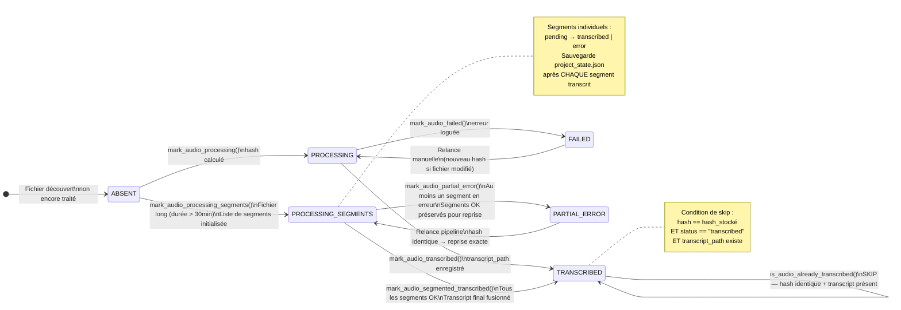
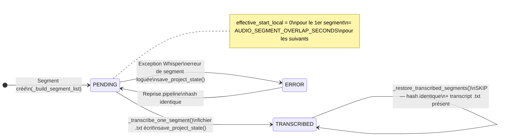
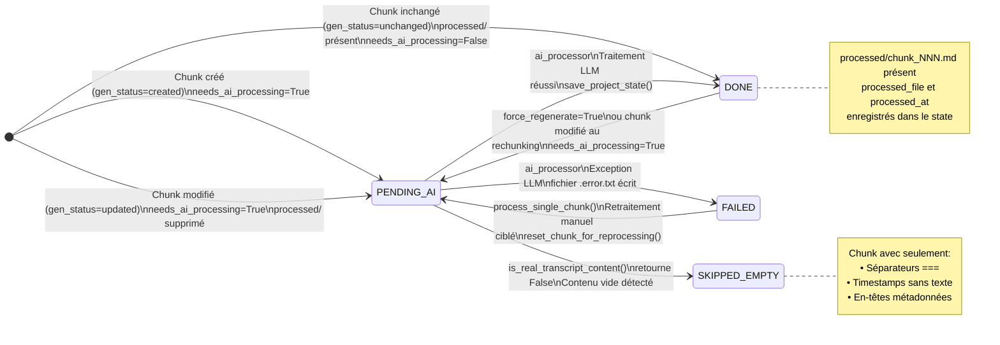
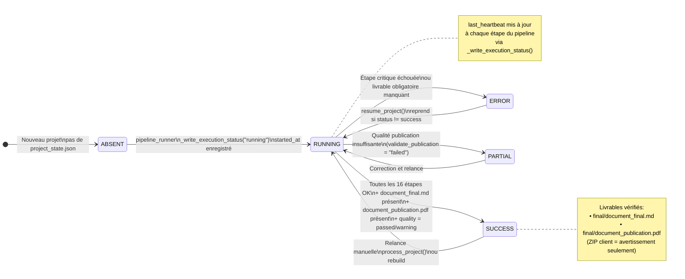
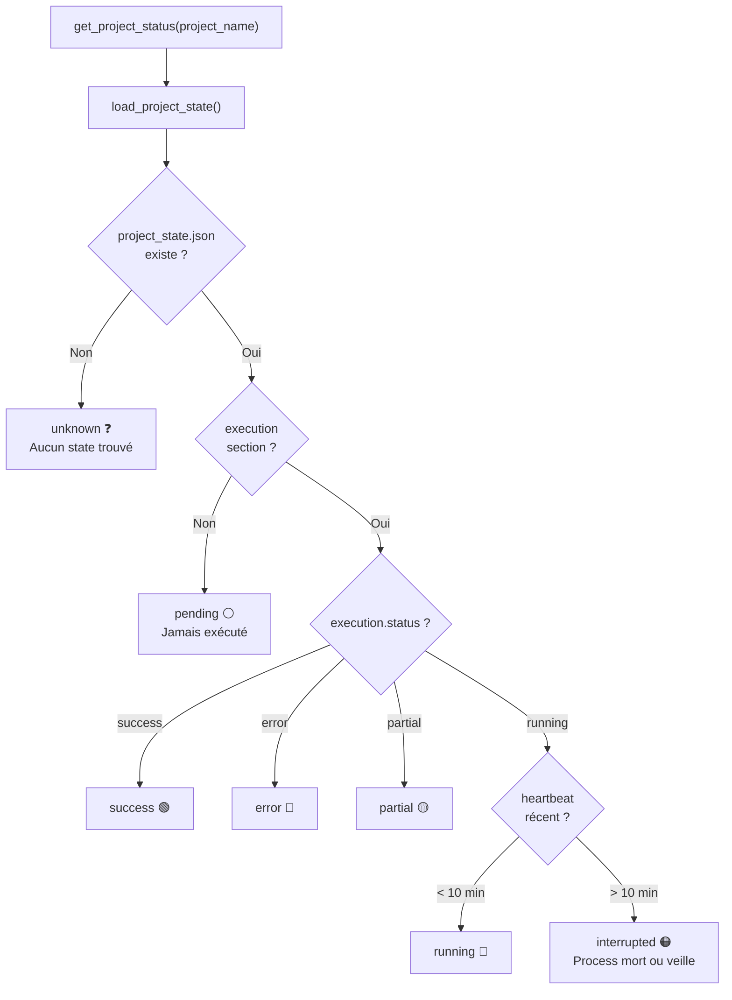
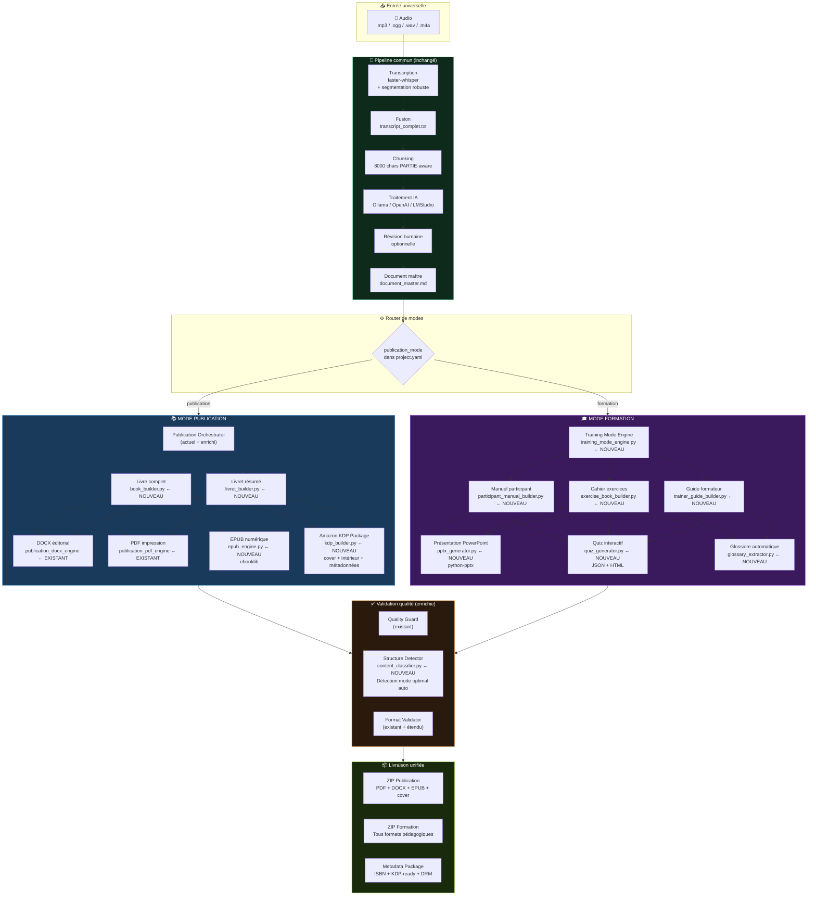

# Machine d'État — PublishForge

## 1. Vue d'ensemble

PublishForge utilise un fichier JSON comme machine d'état persistante pour chaque projet.  
Ce fichier est la clé de la **reprise après interruption** — il permet de reprendre exactement là où le pipeline s'est arrêté.

**Fichier :** `sortie/<projet>/project_state.json`  
**Gestion :** `app/project_state.py`

---

## 2. Structure complète de `project_state.json`

```json
{
  "files": {
    "<chemin_absolu_audio>": {
      "path": "C:\\...\\depot\\<projet>\\fichier.mp3",
      "hash": "md5_du_fichier_binaire",
      "status": "transcribed | processing | failed | processing_segments | partial_error",
      "transcript_path": "C:\\...\\sortie\\<projet>\\transcripts\\fichier.txt",
      "started_at": "2026-06-21T00:20:17",
      "updated_at": "2026-06-21T05:23:33",
      "error": null,
      "segments": {
        "part_001": {
          "status": "transcribed | pending | error",
          "audio_path": "C:\\...\\audio_segments\\<stem>\\part_001.mp3",
          "transcript_path": "C:\\...\\segment_transcripts\\<stem>\\part_001.txt",
          "start_seconds": 0.0,
          "end_seconds": 910.0,
          "effective_start_local": 0.0,
          "updated_at": "2026-06-21T00:20:17",
          "error": null
        }
      }
    }
  },

  "chunks": {
    "chunk_001.txt": {
      "status": "pending_ai | done | failed | skipped_empty",
      "hash": "sha256_du_contenu_textuel",
      "generation_status": "created | updated | unchanged",
      "needs_ai_processing": true,
      "path": "C:\\...\\chunks\\chunk_001.txt",
      "partie_source": "PARTIE 1 — NomFichier",
      "char_count": 7500,
      "word_count": 1200,
      "processed_path": "C:\\...\\processed\\chunk_001.md",
      "processed_file": "C:\\...\\processed\\chunk_001.md",
      "processed_at": "2026-06-22T03:15:42",
      "updated_at": "2026-06-22T03:15:42",
      "error": null
    }
  },

  "corrections": {
    "chunk_001.txt": {
      "status": "generated | applied | no_corrections | partial_error",
      "path": "C:\\...\\corrections\\chunk_001.corrections.md",
      "corrections_path": "C:\\...\\corrections\\chunk_001.corrections.md",
      "reviewed_path": "C:\\...\\reviewed\\chunk_001.md",
      "applied_count": 3,
      "skipped_count": 1,
      "errors": [],
      "updated_at": "2026-06-22T10:30:00"
    }
  },

  "final_document": {
    "status": "generated",
    "path": "C:\\...\\final\\document_final.md",
    "clean_path": "C:\\...\\final\\document_clean.md",
    "generated_at": "2026-06-22T14:00:00",
    "chunks_count": 47,
    "reviewed_chunks_count": 12,
    "skipped_chunks": [],
    "chunks_signature": {
      "reviewed/chunk_001.md": "abc123def456",
      "processed/chunk_002.md": "def456ghi789"
    }
  },

  "publication": {
    "markdown": {"generated": true, "path": "C:\\...\\publication\\publication.md"},
    "docx":     {"generated": true, "path": "C:\\...\\publication\\publication.docx"},
    "pdf":      {"generated": true, "path": "C:\\...\\publication\\publication.pdf"},
    "quality":  {
      "status": "passed | warning | failed",
      "errors": [],
      "warnings": []
    }
  },

  "exports": {
    "docx": {"generated": true, "path": "C:\\...\\final\\document_final.docx"},
    "pdf":  {"generated": true, "path": "C:\\...\\final\\document_publication.pdf"}
  },

  "harmonization": {
    "status": "generated",
    "mode": "light",
    "path": "C:\\...\\harmonized\\document_harmonized.md",
    "generated_at": "2026-06-22T14:30:00"
  },

  "cover": {
    "strategy": "generated | user | typography",
    "path": "C:\\...\\cover\\cover.jpg",
    "generated_at": "2026-06-22T15:00:00",
    "prompt_hash": "sha256_du_prompt_couverture"
  },

  "cover_image": {
    "type": "image",
    "source": "generated",
    "style": "editorial_realistic",
    "provider": "fake"
  },

  "metadata": {
    "path": "C:\\...\\depot\\<projet>\\project.yaml",
    "updated_at": "2026-06-23T09:00:00",
    "last_editor": "streamlit",
    "needs_publication_rebuild": false,
    "needs_cover_rebuild": false,
    "needs_client_zip_rebuild": false
  },

  "editorial": {
    "document_language": "fr",
    "publication_mode": "publication"
  },

  "execution": {
    "status": "success | running | error | partial",
    "started_at": "2026-06-22T03:00:00",
    "last_heartbeat": "2026-06-22T15:30:00",
    "finished_at": "2026-06-22T15:30:00",
    "error": null
  }
}
```

---

## 3. Machine d'état des fichiers audio



---

## 4. Machine d'état des segments (transcription longue durée)



---

## 5. Machine d'état des chunks



---

## 6. Machine d'état globale du projet (exécution)



---

## 7. Statuts UI — `ui_status_service.py`



**Codes couleur dans la sidebar Streamlit :**

| Statut | Emoji | Description |
|--------|-------|-------------|
| `success` | 🟢 | Toutes les étapes terminées avec succès |
| `running` | 🔵 | Pipeline actif (heartbeat récent) |
| `error` | 🔴 | Au moins une étape critique a échoué |
| `interrupted` | 🟠 | Pipeline marqué "running" mais plus de heartbeat |
| `partial` | 🟡 | Pipeline terminé mais qualité insuffisante |
| `pending` | ⚪ | Projet jamais traité |
| `unknown` | ❓ | Pas de `project_state.json` |

---

## 8. Fonctions de manipulation d'état

### Lecture / Écriture

```python
# Lecture — initialise les sections manquantes si besoin
state = load_project_state(project_name_or_project_obj)

# Écriture atomique
save_project_state(project_name, state)
```

### Gestion des fichiers audio

```python
# Vérification skip
is_audio_already_transcribed(state, audio_path, audio_hash, transcript_path)
# → True si hash + status + fichier présents

# Marquage des états
mark_audio_processing(state, audio_path, audio_hash)
mark_audio_transcribed(state, audio_path, audio_hash, transcript_path)
mark_audio_failed(state, audio_path, audio_hash, exception)

# Transcription segmentée
mark_audio_processing_segments(state, audio_path, audio_hash, segments)
update_segment_in_state(state, audio_path, segment)
mark_audio_segmented_transcribed(state, audio_path, audio_hash, transcript_path, segments)
mark_audio_partial_error(state, audio_path, audio_hash, error_msg, segments)
get_audio_segments_state(state, audio_path)
```

### Gestion des chunks

```python
# Enregistrement initial
register_chunk(state, chunk_name)  # status → "pending"

# Mise à jour complète après chunking
update_chunk_state(state, chunk_name, chunk_hash, generation_status,
                   needs_ai_processing, partie_source, char_count,
                   word_count, path, processed_path)

# Statut direct
mark_chunk_done(state, chunk_name)
is_chunk_done(state, chunk_name)

# Réinitialisation
reset_chunk_for_reprocessing(state, chunk_name)   # → "pending"
reset_all_chunks_for_reprocessing(state)          # Tous → "pending"
```

### Réinitialisation pour rebuild

```python
force_reset_project_for_rebuild(
    project_name,
    reset_chunks=True,       # Tous les chunks → "pending"
    reset_final=True,        # Efface final_document
    reset_publication=True,  # Efface publication
    reset_exports=True,      # Efface exports
    reset_cover=False,       # Conserve la couverture par défaut
)
```

### Mise à jour après édition des métadonnées

```python
update_metadata_state(project_name, yaml_path)
# → Pose les flags :
#   needs_publication_rebuild: True
#   needs_cover_rebuild: True
#   needs_client_zip_rebuild: True
```

---

## 9. Stratégie de reprise après interruption

PublishForge est conçu pour résister aux interruptions brutales (veille Windows, crash, Ctrl+C).

### Niveau 1 — Segment audio (granularité : 15 minutes)

```
Pour chaque segment transcrit :
  1. Écriture du fichier .txt du segment
  2. update_segment_in_state() → met à jour le dict "segments"
  3. save_project_state()  ← IMMÉDIAT après chaque segment

Au redémarrage :
  - _restore_transcribed_segments() lit les segments déjà transcrits
  - Si hash identique : les segments "transcribed" avec .txt présent → SKIP
  - Si hash différent : reprise depuis zéro
```

### Niveau 2 — Chunk IA (granularité : 1 chunk ≈ 8000 chars)

```
Pour chaque chunk traité :
  1. Écriture du fichier processed/chunk_NNN.md
  2. chunk["status"] = "done"
  3. save_project_state()  ← IMMÉDIAT après chaque chunk

Au redémarrage :
  - Chunks "done" avec processed/ présent → SKIP
  - Chunks "pending_ai" ou sans processed/ → traitement
```

### Niveau 3 — Run global (granularité : run complet)

```
Début du pipeline :
  _write_execution_status(project, "running", started_at)

À chaque étape (via run_step) :
  Le statut "running" est conservé avec last_heartbeat mis à jour

Fin du pipeline :
  _write_execution_status(project, status, started_at, error, finished_at)
  status = "success" | "error" | "partial"

Au redémarrage :
  - resume_project() : ignore les projets "success"
  - resume_incomplete_projects() : relance uniquement les non-success
  - rebuild_project_from_chunks() : repart depuis les chunks (préserve transcription)
```

---

## 10. Exemple réel — `project_state.json` (pastoral_retreat)

Extrait montrant un fichier long transcrit par segments :

```json
{
  "files": {
    "C:\\TranscriptionAI\\depot\\pastoral retreat\\Pastoral Retreat 2.mp3": {
      "hash": "8d639960a58a30449e66f19b07c972ec",
      "status": "transcribed",
      "started_at": "2026-06-20T22:07:21",
      "updated_at": "2026-06-21T05:23:33",
      "segments": {
        "part_001": {
          "status": "transcribed",
          "start_seconds": 0.0,
          "end_seconds": 910.0,
          "effective_start_local": 0.0,
          "updated_at": "2026-06-21T00:20:17"
        },
        "part_007": {
          "status": "transcribed",
          "start_seconds": 5400.0,
          "end_seconds": 6000.0,
          "effective_start_local": 10.0,
          "updated_at": "2026-06-21T05:23:33"
        }
      }
    }
  },
  "chunks": {
    "chunk_001.txt": {
      "status": "done",
      "hash": "a1b2c3d4...",
      "generation_status": "created",
      "needs_ai_processing": false,
      "processed_at": "2026-06-22T03:15:42"
    }
  },
  "execution": {
    "status": "success",
    "started_at": "2026-06-22T03:00:00",
    "finished_at": "2026-06-22T15:30:00",
    "last_heartbeat": "2026-06-22T15:30:00"
  }
}
```

---

## 11. Architecture cible PublishForge v2



### Nouveaux modules nécessaires pour v2

#### Mode Publication

| Module | Rôle | Dépendance |
|--------|------|------------|
| `publication_epub_engine.py` | Génération EPUB | `ebooklib` |
| `kdp_package_builder.py` | Package Amazon KDP (cover + intérieur + métadonnées KDP) | — |
| `book_structure_analyzer.py` | Détection automatique chapitres/sections via LLM | LLM |
| `isbn_metadata_service.py` | Gestion ISBN, auteur, éditeur, date de publication | — |
| `livret_builder.py` | Construction livret résumé condensé | — |

#### Mode Formation

| Module | Rôle | Dépendance |
|--------|------|------------|
| `training_mode_engine.py` | Orchestrateur mode formation | — |
| `participant_manual_builder.py` | Manuel du participant formaté | — |
| `exercise_book_builder.py` | Cahier d'exercices avec espaces réponses | — |
| `trainer_guide_builder.py` | Guide du formateur avec corrigés | — |
| `pptx_generator.py` | Présentation PowerPoint structurée | `python-pptx` |
| `quiz_generator.py` | Quiz JSON + HTML interactif | LLM pour génération questions |
| `glossary_extractor.py` | Extraction automatique termes clés | LLM |
| `learning_objectives_extractor.py` | Objectifs pédagogiques SMART | LLM |

#### Couche IA enrichie

| Module | Rôle |
|--------|------|
| `content_classifier.py` | Détection automatique du mode optimal (pub vs formation) |
| `structure_detector.py` | Analyse de la structure documentaire |
| `terminology_harmonizer.py` | Harmonisation des termes spécialisés entre chunks |
| `multilingual_adapter.py` | Adaptation multilingue (fr/en/es/de) |

### Roadmap de migration

#### Phase 1 — Consolidation technique (court terme)
1. Extraire `_run_steps()` partagé dans `pipeline_runner.py`
2. Schéma Pydantic pour `project_state.json` + `schema_version`
3. Archiver le code legacy de `transcription_service.py`
4. Tests d'intégration pipeline avec `FakeAIEngine`

#### Phase 2 — Mode Formation (moyen terme)
1. `training_mode_engine.py` + `participant_manual_builder.py`
2. `pptx_generator.py` (python-pptx)
3. `quiz_generator.py` (LLM-assisted)
4. Router de modes dans `pipeline_runner.py`

#### Phase 3 — Mode Publication avancé (long terme)
1. `publication_epub_engine.py` (ebooklib)
2. `kdp_package_builder.py`
3. `isbn_metadata_service.py`
4. `content_classifier.py` (détection automatique du mode)
